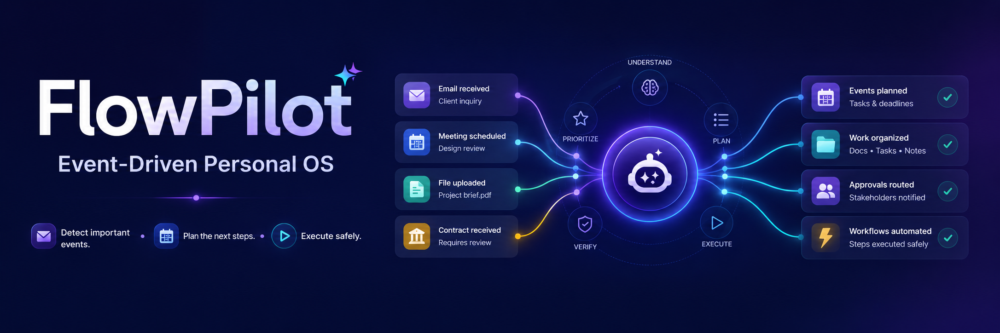

<p align="center">
  
</p>

<h1 align="center">FlowPilot</h1>
<p align="center"><strong>A safety-first, event-driven personal automation OS.</strong></p>
<p align="center">
  Turn important life events into transparent, policy-governed action plans—while keeping every consequential action under human control.
</p>

<p align="center">
  
  
  
  
  
</p>

## Why FlowPilot?

Personal automation should not be a black box. FlowPilot interprets a trusted event, matches it to a user-defined standing order, creates a deterministic action DAG, evaluates every action against a risk policy, and records the outcome in an auditable timeline.

```text
Event arrives → normalize & classify → match standing order → build action plan
      → apply deterministic policy → execute safe work → request approval when needed
```

## Hero workflows

| Workflow | What FlowPilot prepares | Human control point |
| --- | --- | --- |
| ✈️ **Travel Autopilot** | Trip folder, ticket reference, calendar event, weather, itinerary and packing checklist | Family Telegram message waits for approval |
| 🚀 **Client Launch** | Requirements README, private GitHub workspace, proposal, invoice template and a kickoff suggestion | Client reply waits for approval |
| 💰 **Salary Autopilot** | Mock salary ingestion, deterministic allocations, CSV budget artifact and overspend warning | Bank transfer is only a red proposal—never a real transfer |

## Safety by design

- **No autonomous financial execution.** The project has no connector capable of transferring funds.
- **Deterministic policy engine.** AI can suggest only validated, registered plan parameters; it cannot call tools directly.
- **Approval gates for consequential actions.** Telegram delivery and red-risk actions wait for an explicit decision.
- **Idempotent external writes.** Calendar, Drive and GitHub actions use durable idempotency markers.
- **Privacy-aware boundaries.** Connector credentials are encrypted at rest; external content is treated as untrusted data.
- **Auditable execution.** Ingestion, planning, policy, approval and execution transitions are retained in the activity ledger.

## Architecture

```text
Next.js PWA ── authenticated API calls ──▶ FastAPI
                                             │
                             ┌───────────────┼────────────────┐
                             ▼               ▼                ▼
                        Event gateway    Policy engine    Durable job queue
                             │               │                │
                             └──────▶ Action DAG ◀────────────┘
                                             │
                         Google · GitHub · Open-Meteo · Telegram · internal documents
```

## Repository layout

```text
apps/
  api/          FastAPI API, workflows, policy, connectors and worker services
  web/          Next.js App Router dashboard and responsive UI
packages/
  contracts/    Versioned event, action and standing-order JSON contracts
docs/           Product, architecture, safety and local-development documentation
```

## Run locally

### Prerequisites

- Python 3.11+
- Node.js 20+
- Docker Desktop with Docker Compose

> Environment files are intentionally not committed. Create local `apps/api/.env` and `apps/web/.env.local` files as needed; never add credentials, tokens, or Supabase keys to Git.

1. Start PostgreSQL:

```powershell
docker compose up -d postgres
docker compose exec postgres pg_isready -U flowpilot -d flowpilot
```

2. Start the API in one terminal:

```powershell
Set-Location apps\api
py -3.11 -m venv .venv
.venv\Scripts\python -m pip install --upgrade pip
.venv\Scripts\python -m pip install -e ".[dev]"
.venv\Scripts\python -m uvicorn app.main:app --reload --port 8000
```

3. Start the web app in a second terminal:

```powershell
Set-Location apps\web
npm ci
npm run dev
```

The API health check is available at [http://localhost:8000/health](http://localhost:8000/health).

## Quality checks

```powershell
# Backend
Set-Location apps\api
ruff check .
ruff format --check .
mypy app
pytest

# Frontend
Set-Location ..\web
npm run lint
npm run typecheck
npm run test
npm run build
```

## Documentation

- [Product scope](docs/01-product-scope.md)
- [System architecture](docs/02-system-architecture.md)
- [Safety and policy model](docs/05-safety-and-policy.md)
- [API and realtime design](docs/06-api-and-realtime.md)
- [Local development guide](docs/LOCAL_DEVELOPMENT.md)

## Current boundaries

FlowPilot is a demo MVP. OAuth configuration, deployment credentials, demo data, and all environment files are intentionally local-only. The simulated Salary Autopilot is designed to demonstrate safe planning—not banking, purchases, or investment execution.

---

Built to make automation **visible, reversible where possible, and always accountable**.
